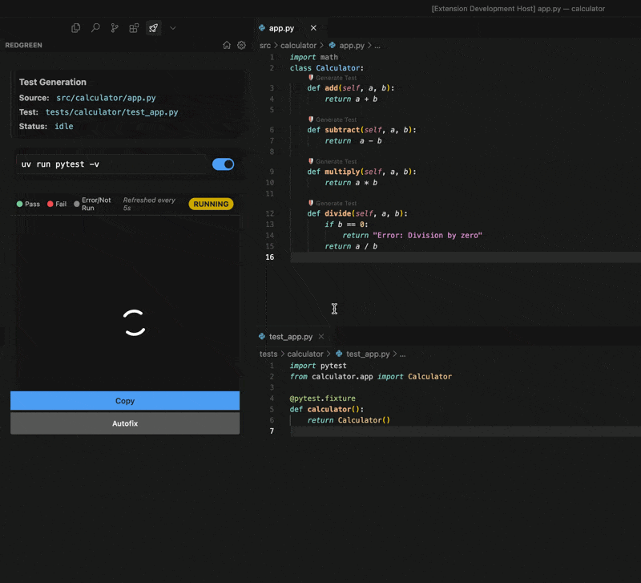

# RedGreen

  

**Build it right. Before you build it all.**

Achieve 100% test coverage in minutes with AI-powered test generation.
This uses OpenAI's [codex-cli](https://github.com/openai/codex)'s agent capabilities to generate and fix the code

## What it does

Redgreen uses AI to instantly generate comprehensive tests for your code. Stop writing boilerplate tests manually and focus on building features that matter.

- ✅ Generate complete test suites with a single click
- 🔄 Supports the Red-Green-Refactor TDD workflow
- 📈 Maximize code coverage without the tedium
- 🔌 Works with JavaScript, TypeScript, Python, Java, and Go
- 🧰 Compatible with Jest, Mocha, PyTest, and JUnit

## Get started

1. Open your source file
2. Click "Generate Test" from the command palette
3. Watch as RedGreen creates a comprehensive test suite

## Requirements

- VS Code 1.95.0 or higher
